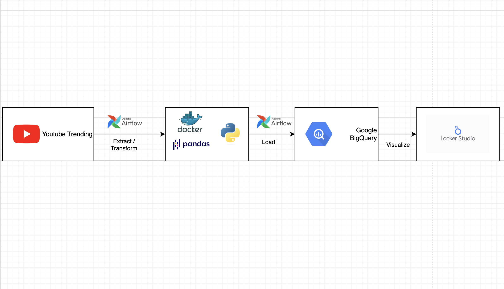

# ETL Youtube Trend to BigQuery/MySQL

Make sure you have installed Docker on your device.

first thing, you have to clone this project

```
git clone git@github.com:fadhelmurphy/ETL-BigQuery-MySQL.git

cd ETL-BigQuery-MySQL
```

## Setup *.env* files

You must create .env file on root project

```
AIRFLOW_USER_USERNAME=admin
AIRFLOW_USER_PASSWORD=admin

MYSQL_USER=fadhel
MYSQL_PASSWORD=root
MYSQL_ROOT_USER=root
MYSQL_ROOT_PASSWORD=root

GCP_PROJECT_ID=YOUR_GCP_PROJECT_ID
GCP_DATASET_ID=YOUR_BIGQUERY_DATASET_ID
GCP_TABLE_ID=YOUR_BIGQUERY_TABLE_ID
CREDENTIALS_FILE=credentials.json

```

## Run Project

after you created the files, you can run this project through Docker by this command down below.

`docker compose up -d`

if you want to stop run this project, you can type this command down below.

`docker compose down`
